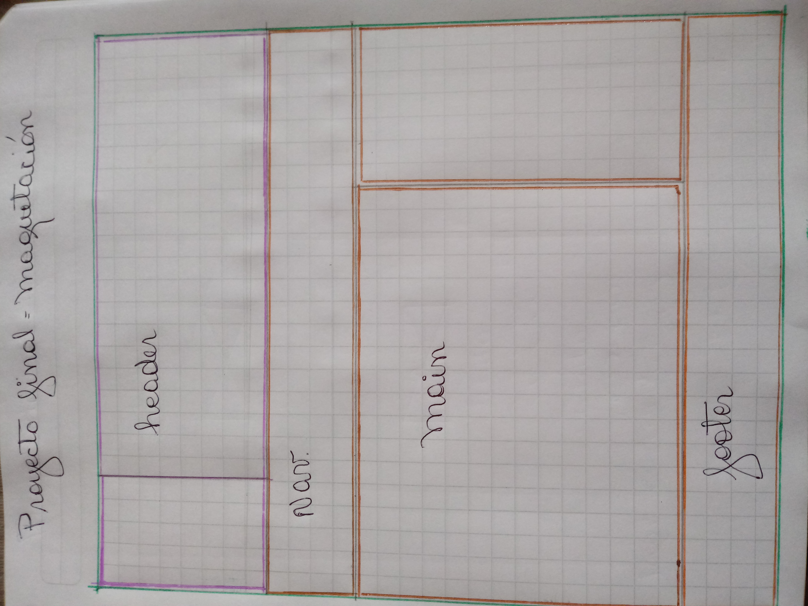
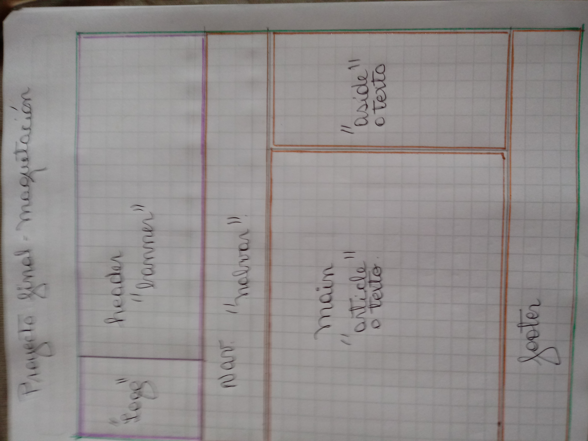
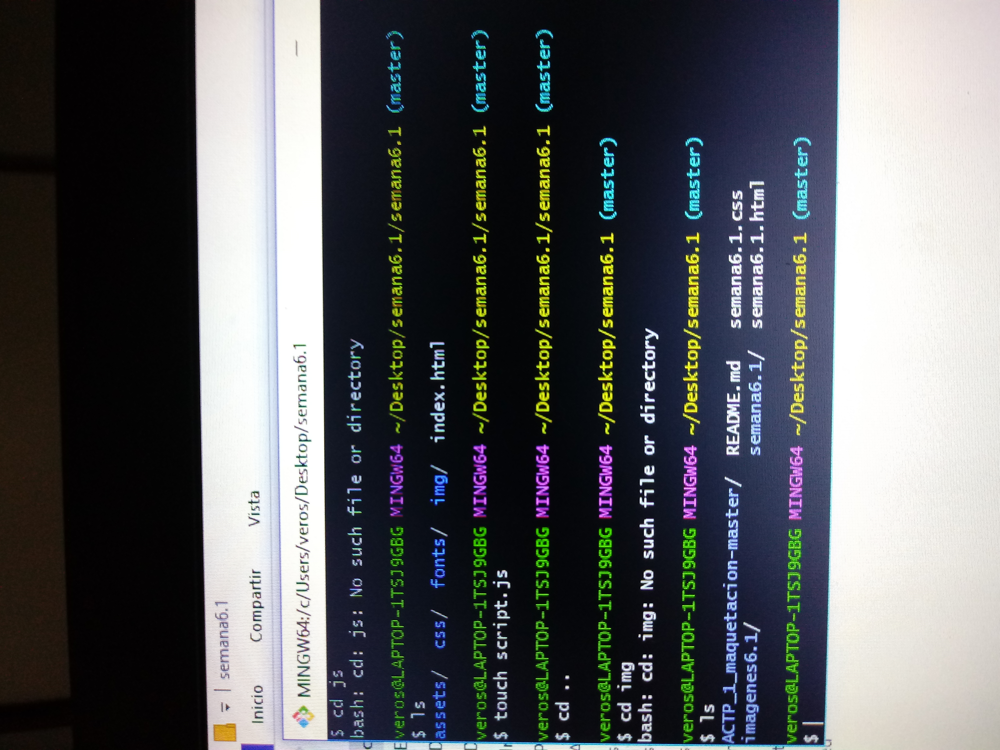

README.md

Tema: "Ruta Turística de  Quilicura"

Tema del Proyecto Tripadvisor de la Comuna

Debe contener como mínimo secciones de hitos turísticos en quilicura,

arte callejero, arquitectura, gastronomía, lugares imperdibles y contacto.

El proyecto debe considerar la implementación de los siguientes items:

Distribución (4 puntos)

Temas para el Proyecto

Evaluación (puntaje por ítem)

Creación de repositorio (1 punto)

Git & Github (1 punto)

README.md (descripción e instrucciones) (1 punto)

Creación de estructura de directorios (1 punto)

Ideación (4 puntos)

Objetivos para la interfaz y para la experiencia del usuario (1 punto)

Requerimientos del sitio (1 punto)

Definición de layout (1 punto)

Boceto a mano (imagen agregada a README.md y a carpeta images) (1
punto)

HTML5 (3 puntos)

Uso correcto de etiquetas (semántica) (1 pto)

El uso del meta viewport en cada página (1 pto)

Sintaxis e indentación correcta (1 punto)

CSS (4 puntos)

Utilizar una hoja de estilo llamada de forma externa (1 punto)

Uso de display block e inline-block (1 pto)

Uso de al menos 2 reglas de position (1 pto)

Uso de al menos 2 medias querys personalizadas (1 pto)

Bootstrap 3 (3 puntos)

Uso correcto del sistema de grillas (2 pto)

Incorporación de al menos un formulario con estilos de Bootstrap (1 pt (1 pto)

Responsive (4 puntos)

Correcta visualización en xs, sm, md y lg (4 pto)

Información (1 puntos)

Creación de contenido original, sin uso de Lorem Ipsum (1 pto)

Se debe subir el link del repositorio a la plataforma Empieza.

Fecha de entrega proyecto: 28 de Junio 2018.

Fecha de entrega evaluación: 04 de Julio 2018

Estructura de Maquetación

